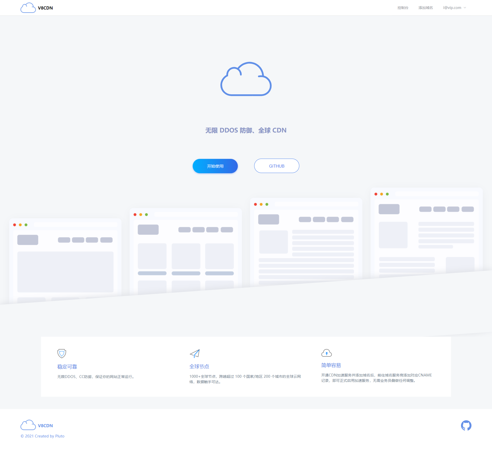
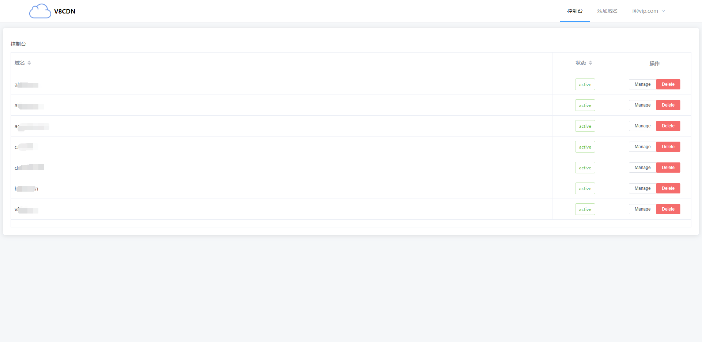

<p align="center">
    
</p>
<p align="center">
  <a href="https://github.com/aoaostar/v8cdn/releases"></a>
  <a href="https://github.com/aoaostar/v8cdn/actions?query=workflow%3ABuild"></a>
  <a href="https://github.com/aoaostar/v8cdn/releases"></a>
  <a href="https://github.com/aoaostar/v8cdn/blob/master/LICENSE"></a>
</p>

### What's this？
这是一款`Cloudflare Partner`面板程序，后端基于`gin`，前端使用`vue.js`。

### 前端项目地址

* <https://github.com/aoaostar/v8cdn-panel>

### 演示地址

* <https://cdn.v8cdn.cc>

### 演示图




### 部署

#### 配置说明
* 后端配置
```shell
app_name: v8cdn # 应用名称
debug: false # Debug
listen: 0.0.0.0:8080  # 监听 ip + 端口
jwt_secret: v8cdn # jwt秘钥，自己随便设置
static: dist # 前端目录
cloudflare:
  email: email # cloudflare partner邮箱
  host_key: host_key # cloudflare partner host_key
RateLimit:
  enabled: false # 是否启用api请求频率限制
  fill_interval: 30 # 时间周期，单位：秒
  capacity: 30  # 单位时间周期内最大只能请求多少次，超过了返回频率限制error
```
* 前端配置
```js
window['V8CDN'] = {
    appName: "V8CDN", // 项目名称
    apiUrl: "//cdn.v8cdn.cc", // 后端api
    instructions: "https://blog.aoaostar.com/10.html", // 使用说明跳转地址
}
```
#### 使用说明
    + `releases`下载对应的包
    + 然后运行即可

```shell
chmod +x v8cdn
nohup ./v8cdn > log.log 2>&1 &
```

* 进程守护
    + vi /usr/lib/systemd/system/v8cdn.service
    + 添加以下内容，其中`app_path`为`v8cdn`所在的路径

```shell
[Unit]
Description=v8cdn
After=network.target
 
[Service]
Type=simple
WorkingDirectory=app_path
ExecStart=app_path/v8cdn
Restart=on-failure
 
[Install]
WantedBy=multi-user.target
```

* 然后执行`systemctl daemon-reload`重载配置

```
启动: systemctl start v8cdn
关闭: systemctl stop v8cdn
自启: systemctl enable v8cdn
状态: systemctl status v8cdn
```

### 反向代理

* 由于项目运行在`8080`端口，所以需要`nginx`反向代理
```
location / {
    proxy_set_header X-Forwarded-For $proxy_add_x_forwarded_for;
    proxy_set_header Host $http_host;
    proxy_set_header X-Real-IP $remote_addr;
    proxy_redirect off;
    proxy_pass http://127.0.0.1:8080;
}
```

* 使用`gin`代理静态资源需要注释以下内容，否则静态文件无法加载

```
location ~ .*\.(gif|jpg|jpeg|png|bmp|swf)$
{
    expires      30d;
    error_log /dev/null;
    access_log /dev/null;
}
location ~ .*\.(js|css)?$
{
    expires      12h;
    error_log /dev/null;
    access_log /dev/null;
}
```

### 配置前端

* 下载前端
<https://github.com/aoaostar/v8cdn-panel/releases>
* 将`dist`目录复制到后端根目录
* 修改前端项目根目录下的`config.js`内容
* 没有`Cloudflare Partner`的可以使用别人的后端`api`，这样无需搭建后端，只需要配置前端的`api`就行了
* 没看懂看下方目录结构

#### 目录结构
```shell
.
├── config.yaml
├── dist
│   ├── config.js
│   ├── css
│   │   ├── app.51c8db65.css
│   │   └── chunk-vendors.3ec84ff3.css
│   ├── favicon.ico
│   ├── fonts
│   │   ├── element-icons.535877f5.woff
│   │   └── element-icons.732389de.ttf
│   ├── img
│   │   ├── logo.2afbdd11.png
│   │   ├── prototype-1.61488008.png
│   │   ├── prototype-2.6cdf2ad6.png
│   │   ├── prototype-3.12a59943.png
│   │   └── prototype-4.723e3a43.png
│   ├── index.html
│   └── js
│       ├── app.d4502f7d.js
│       ├── app.d4502f7d.js.map
│       ├── chunk-vendors.3f91d629.js
│       └── chunk-vendors.3f91d629.js.map
├── logs
│   └── 2021-09-07.log
└── v8cdn
```


### 交叉编译

* <https://golang.google.cn/doc/install/source#introduction>
* <https://golang.google.cn/doc/install/source#environment>